# Basic Pentesting

### Overview
This room focuses on web and network penetration testing. The objective was to enumerate services, gain initial access, escalate privileges, and fully compromise the target.


### Environment 
- Platform : TryHackMe
- Difficulty : Easy
- Machine : Basic Pentesting

[Room Link](https://tryhackme.com/room/basicpentestingjt)

#### Task 1 : Web APP Testing And Privilege Escalation

**1.1** Deploy the machine and connect to our network

Start the machine and by clicking the green start machine button and use your attack box or your vm by connecting thorugh open vpn. 

**1.2** Find the services exposed by the machine

To identify the service running on the target machine we use nmap ("network mapper"). it is free and open source utility for network scanning.

``` nmap -sV <Target ip> ```
 
 **-SV** : It will show the version of all the services we found on the target.

 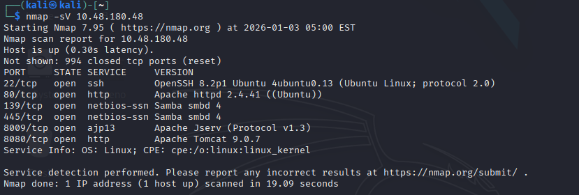

 so there are 6 open ports. we will start exploring from port 80 and 8080 http and then rest of the ports.

 - ssh (port 22)
 - http (port 80)
 - smb (port 139)
 - smb (port 445)
 - ajp13 (port 8009)
 - http (port 8080)

so when we visited the website the website seems to be under mantainance.

 **1.3** What is the name of the hidden directory on the web server(enter name without /)?

 For finding the hidden directory we will use gobuster to brute force enumeration of files and directories.

 ``` gobuster mode -u httP://<targetip>  -w wordlist.txt```

 ``` gobuster dir -u http://10.48.180.48/ -w /usr/share/wordlists/dirbuster/directory-list-2.3-medium.txt ```

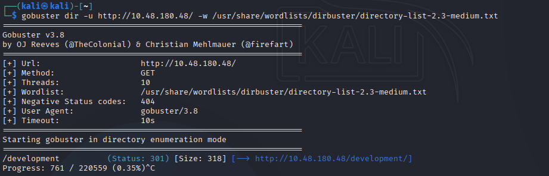

so we can see the hidden directory is development. so let's see if there is anything there.

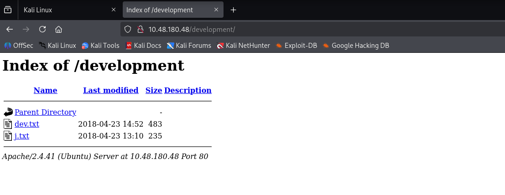

so we can see there are 2 txt files dev.txt and j.txt let's read it and see what's here.

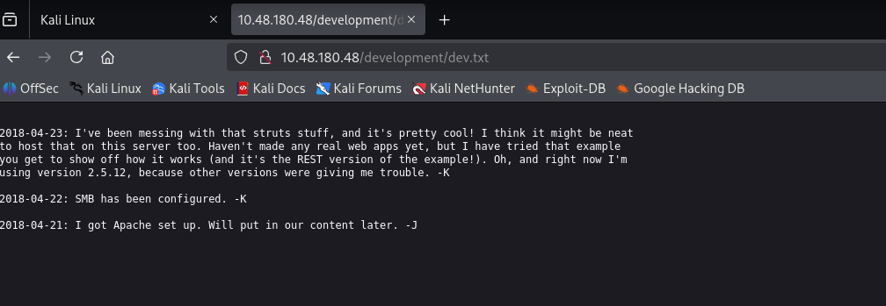

so from the conversation among the developers we got some information.

- REST version 2.5.12
- SMB And Apache

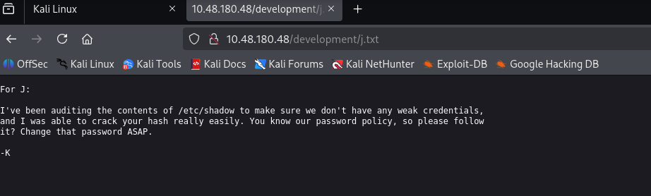

In this conversation they are talking about weak passwords and the password hash is crackable.

So based on the exploration of port 80 we got some information. Alright, as there is a mention of smb in the conversation and we have open port with smb so let's explore it. 

**1.4** User brute-forcing to find the username & password

so for finding username and password we use enum4linux . it is a tool used to enumerate smb shares on both windows and linux systems. 

``` enum4linux [option] <ip>```

``` enum4linux -a 10.48.180.48```
 
 **-a** include full basic enumeration (userlist, machine list, sharelist , password policy , group and member list)

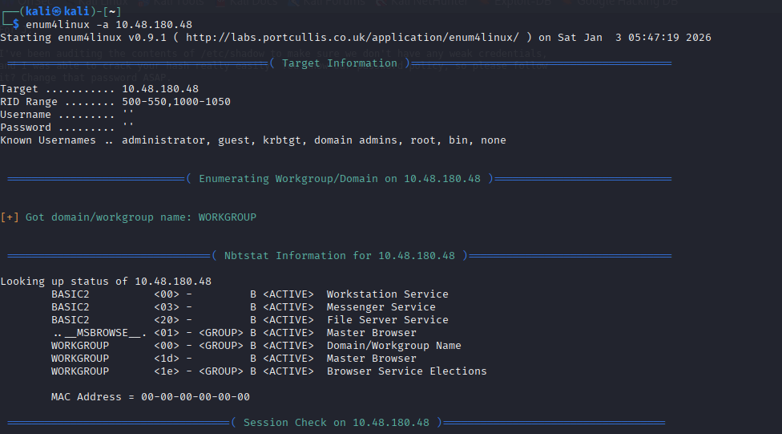

This Process will take some time.

so as we can see we get two username kay and jan.

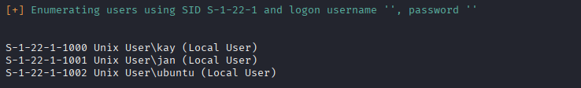

**1.5** What is the username?

Alright, we have 2 username kay and jan we will try both of them and jan is correct one.

As port 22 (ssh) is open we try to login as jan as from conversation we know he has a weak password But wait!

**1.6** What is the password?

Alright here we will use hydra to brute force the password and then try to login as jan using ssh.

``` hydra -l username -P passlist.txt ssh://ip```

```hydra -l jan -P /usr/share/wordlists/rockyou.txt ssh://10.48.180.48```

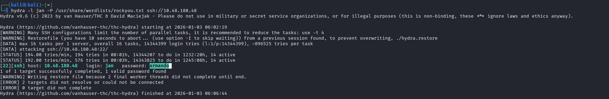

so we got the password : armando

Alright, we have username and password let's login ssh. 

```ssh jan@10.48.180.48```


**1.7** What service do you use to access the server(answer in abbreviation in all caps)?

so answer is SSH 

**1.8** Enumerate the machine to find any vectors for privilege escalation

Alright, for finding the ways of privilege escalation there are two way first we can use linenum.sh script or we can do it manually.

we will try it manually but just for the one who want to try it with the script. you can download the script on your local machine then get on the target machine (jan ssh) using local python http-server.

Alright, we start manually first we check is there any misconfiguration in files like `/etc/passwd` , `/etc/shadow`

we don't have write access in both of the files but we can read the passwd file using `cat /etc/passwd` so we read that and see if there is any other user. 

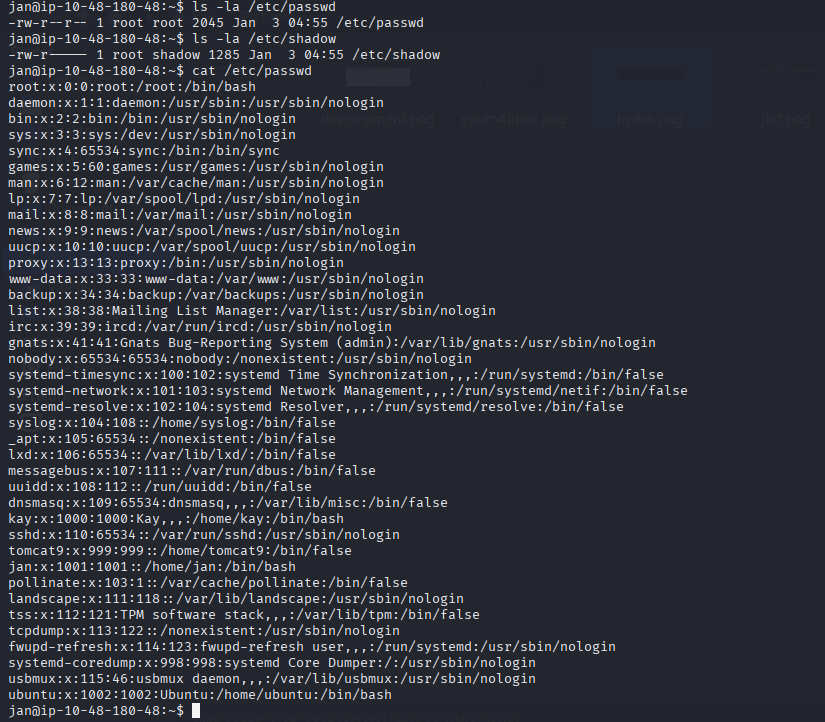

**1.9** What is the name of the other user you found(all lower case)?

we can see there is another user in the system named **kay**. 

**1.10** If you have found another user, what can you do with this information?

Alright, as we know there is another user let's see can we find anything there let's go to `cd /home/kay` . here is file pass.bak but we can't read it as we don't have permission. let's try to check hidden files  using `ls -a`.

so here is hidden directory .ssh let's go there and list all the files present. we can see there is id_rsa file containing ssh private key so we can use it to login as kay. 

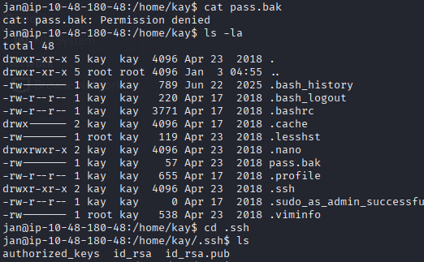

let's read the id_rsa file using `cat id_rsa` we can see the content of rsa file but it's is encrypted but no worry we can try to crack it using john. copy the content of the file and save it.

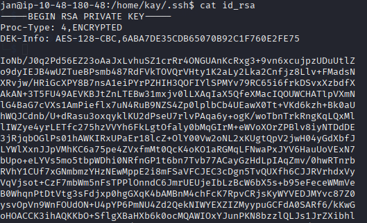

Now, give it permission `chmod 600 <file name> ` it give the read and write permission to us. Alright, but when we try to login now as kay using this private key it will ask for passphrase and we need to crack it to login.

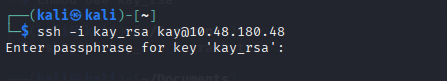

Now we will use john to crack the password. `ssh2john id_rsa > crack.txt` it will write the result in to the crack.txt .

Alright now we crack the hashing using `john --wordlist=/usr/share/wordlists/rockyou.txt  crack.txt`  and then we use `john crack.txt --show` to see the passphrase. 

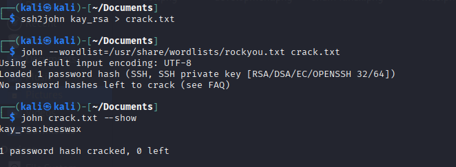

So we got the passphrase : **beeswax** now we login using this passphrase as kay. `ssh -i kay_rsa kay@10.48.180.48`

**1.11** What is the final password you obtain?

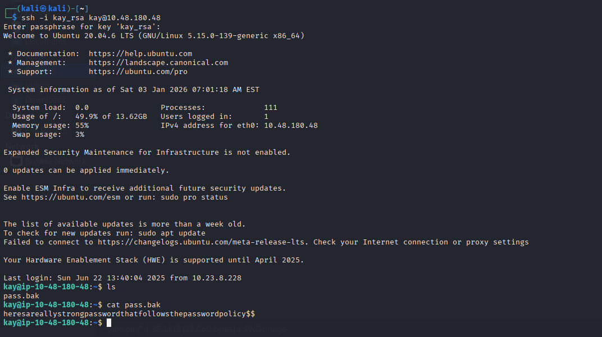

 As we got the access as kay now can we read the file using `cat pass.bak` and we got the final password **heresareallystrongpasswordthatfollowsthepasswordpolicy$$**


 ### Conclusion

we started  the attack with an **Nmap** scan to identify the running services on the server. As there is http port open we tried to enumerate over hidden directory using **gobuster** after enumerating we accessed that directory got some information from that site about weak passwords and smb .

 Then we enumerate over smb using **enum4linux** got some users then we tried to brute force there ssh using **hydra** . after gaining access to the ssh we tried to see if there is another user. Then we got private ssh key of that user but that's encrypted then we tried to crack that hash using **john** and then we finally got the final password. 


